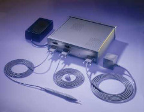
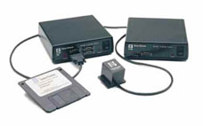

# Polhemus for Java

This package is a development package for Java to use tracking devices of Polhemus and Intersense on Java platforms. Currently, the following devices are supported.

Company | Product | Image
---|---|----
Polhemus | Fastrak / Isotrak2 | 
Intersense | IS300 (Maybe you can run IS600 using the IS300 driver) | 

### Setup

To use the package, you have to install latest Java Communications API. You can get the packages from Sun’s Java site.

### Class Overview

#### Polhemus Class

Polhemus class is a super class of Fastrak, Isotrak2 and IS300 class.
Use the following methods to get the position data and the orientation
data etc.

```
public class Polhemus {
  public Polhemus(int device, int speed);
  public int getActiveReceivers();
  public void getPosition(int nReciver, float pos[3]);
  public void getOrientation(int nReciver, float euler[3]);
}
```

##### Polhemus(int device, int speed)

- device : Specifies a number of the serial port. You can use the platform independent defines Fastrak.SERIAL1 or Fastrak.SERIAL2.
- speed : Specifies the baud rate that is a communication speed with a Polhemuse device.

The constructor creates an instance that is used to communicate with a
Polhemus device The constructor is called by a constructor of Fastrak,
Isotrak2 and IS300 class.

##### int getActiveReceivers(void)

The method returns a number of active receivers.

##### void getPosition(int nReciver, float pos[3])

The method retrieves a current position of a specified active receiver. The valid range of the nReciver is from 1 to the value returned by getActiveNRecivers()

##### void getOrientation(int nReciver, float euler[3])

The method retrieves current euler angles of a specified active receiver. The valid range of the nReciver is from 1 to the value returned by getActiveNRecivers()

#### 3.2 Fastrak / Isotrak2 / IS300 Class

Fastrak, Isotrak2 and IS300 class are sub class of Polhemus class. I show only the coustructors of the sub classes bellow. The arguments are same as Polhemus class.

```
public class Fastrak extends Polhemus {
  public Fastrak(int device, int speed);
}

public class Isotrak2 extends Polhemus {
  public Isotrak2(int device, int speed);
}

public class IS300 extends Polhemus {
  public IS300(int device, int speed);
}
```

### Revision

Revision | Date | Note
---|---|---
1.0 | 1999/05/20 | The first release.

### License

This package is provided "AS IS". Licenser disclaims all warranties,
including but not limited to, all express or implied warranties of
merchant ability and fitness for a particular purpose. Everyone can use
the package for commerce or personal purposes free.
